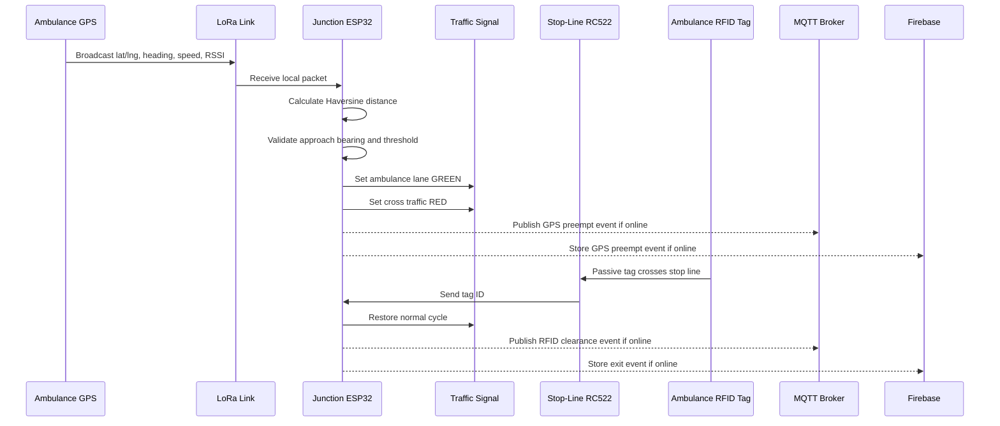

# System Architecture

## Layers

### 1. Ambulance Unit

Main responsibilities:

- Driver emergency activation through mobile app.
- GPS location upload through the app or vehicle ESP32.
- GPS coordinate broadcast through LoRa for local intersection preemption.
- Ambulance identity through fixed RFID tag.
- Hospital route and status display.

Recommended components:

- Android phone running driver app.
- ESP32 if vehicle-side telemetry is needed.
- Neo-6M GPS module if GPS is handled by ESP32.
- LoRa transceiver for local coordinate packets.
- RFID tag mounted on ambulance.

### 2. Smart Traffic Signal Unit

Main responsibilities:

- Validate the ambulance RFID tag at the stop-line clearance checkpoint.
- Validate ambulance ID locally.
- Receive ambulance GPS packets through LoRa.
- Calculate distance using Haversine formula.
- Calculate approach lane using bearing trigonometry.
- Override signal for the ambulance lane before the stop line.
- Use RSSI proximity fallback if GPS fails.
- Read same tag at the physical stop line for exact clearance.
- Restore normal signal cycle.
- Upload event logs when internet is available.

Recommended components per junction:

- ESP32.
- LoRa receiver/ground station.
- RC522 RFID reader at the stop line.
- Relay module or LED signal prototype.
- OLED/LCD display.
- Wi-Fi for cloud logging.

### 3. Cloud/IoT Layer

Main responsibilities:

- Store ambulance GPS location.
- Store emergency trip status.
- Store LoRa GPS approach telemetry.
- Store RFID clearance events.
- Store junction status.
- Store hospital records.
- Support dashboard updates.

Recommended prototype stack:

- Firebase Realtime Database.
- Firebase Authentication if login is required.
- MQTT broker for IoT-style telemetry.
- Firebase stores app/dashboard state; MQTT carries device events.

### 4. Dashboard Layer

Main responsibilities:

- Show active ambulance trips.
- Show live ambulance location.
- Show junction status.
- Show green corridor status.
- Show event logs and analytics.
- Allow manual override for demo/control room flow.

Recommended stack:

- React + Vite.
- Firebase SDK.
- MQTT client for live junction telemetry if needed.
- Google Maps or Leaflet.
- Responsive layout for mobile and laptop.

## Hybrid Signal Priority Flow

## Tracking Zones

The junction has two tracking zones:

- Long range: ambulance GPS coordinates are sent over LoRa and checked locally using distance and bearing.
- Close range: RC522 scans the ambulance RFID tag at the white stop line to confirm the vehicle has cleared the junction.

If GPS is unavailable, the junction can use LoRa RSSI as a degraded proximity signal. RSSI fallback should require several consecutive stronger packets and should use a conservative timeout because it cannot prove lane direction.

## Timeout Flow

If GPS/LoRa preemption starts but the stop-line RFID reader does not detect clearance within the timeout window:

- Restore normal signal cycle.
- Log incomplete passage.
- Mark event as `timeout_restore`.
- Show warning on dashboard.

## Default Hardware Choice

Use RC522 RFID readers for the first prototype because they are common, low-cost, and easy to test with ESP32. Keep the code organized behind a function such as `readClearanceTag()` so RC522 can be swapped later for PN532 or active RFID without rewriting the signal state machine.

Use LoRa for local approach telemetry because it keeps the junction independent from mobile internet latency. Keep GPS parsing, distance calculation, bearing calculation, and RSSI fallback as separate firmware modules.
